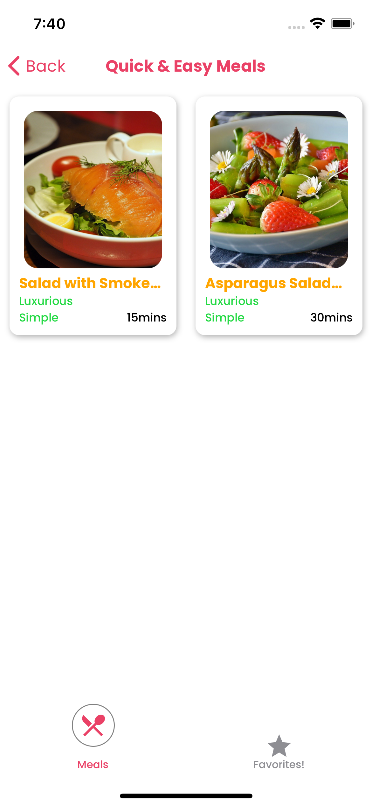
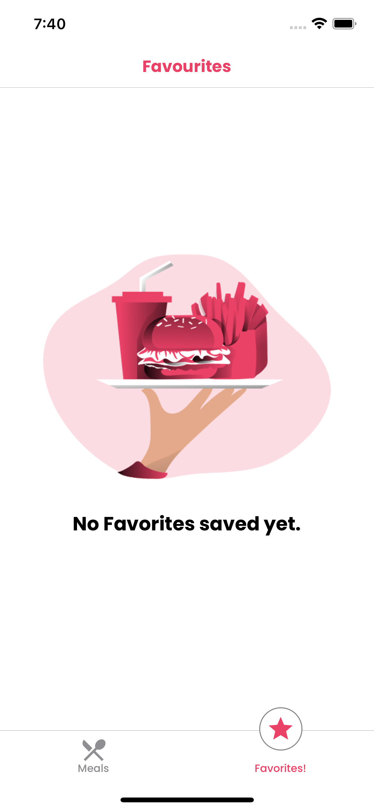

## IOS and Android Meals Application 
**Home Screen & Meals Screen**

  
   

**Meal Details & Favorites Screen**

  

  

**Simple Meal Application** 

The application shows meals with categories and filters applied
App is packed with StackNavigation, TabNavigation and DrawerNavigation

