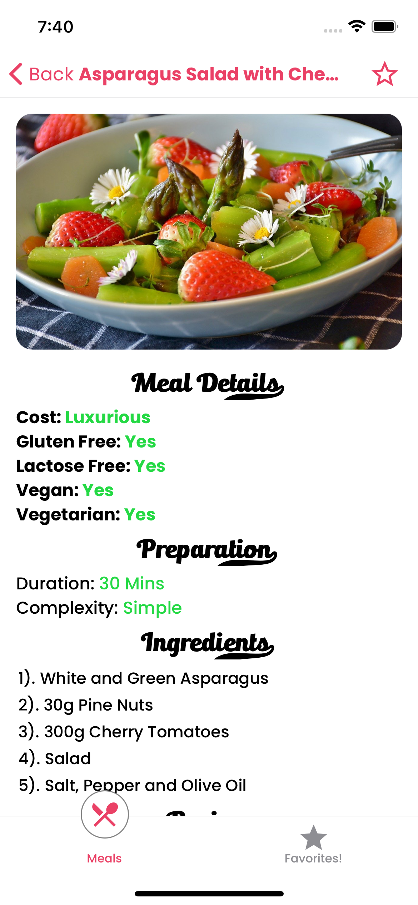

**Home Screen**

  

**Meals**

  

**Meal Details**

  

  

**Simple Meal Application** 

The application shows meals with categories and filters applied
App is packed with StackNavigation, TabNavigation and DrawerNavigation
